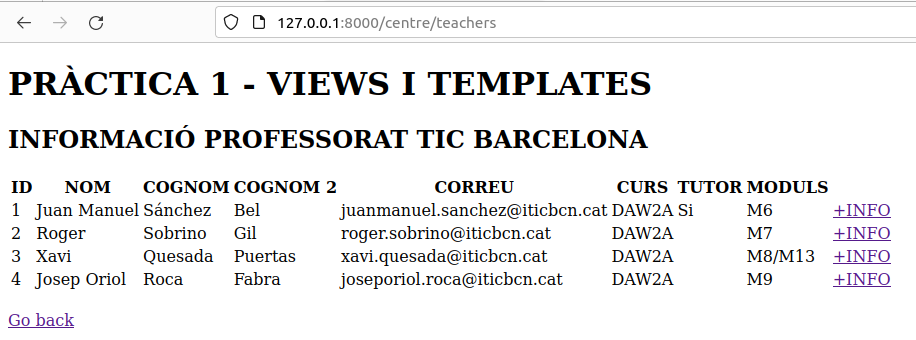

# M07_UF4
## UF4 - SERVEIS WEB. PÀGINES DINÀMIQUES INTERACTIVES. WEBS HIBRIDES

### Taula professor


### Taula alumnes


### [Demo activitat 2](https://drive.google.com/file/d/1Vw5-V4fLL-QKGA_ugFr8OlePMGbYCRaK/view?usp=sharing)

------------------------------------------------------
## PRÀCTICA 2 - MODEL (POSTGRESQL)

```
python manage.py migrate
```


```
python manage.py makemigrations
```


Taula de model centre_user:


### [Video demo migrate](https://drive.google.com/file/d/1n0y7QCXWphVDDEWahLKkhX8CzIMhSVJb/view?usp=sharing)